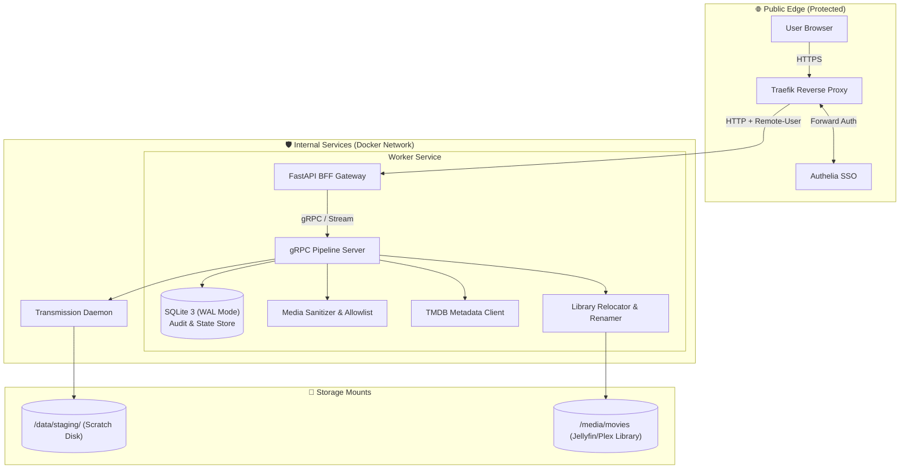
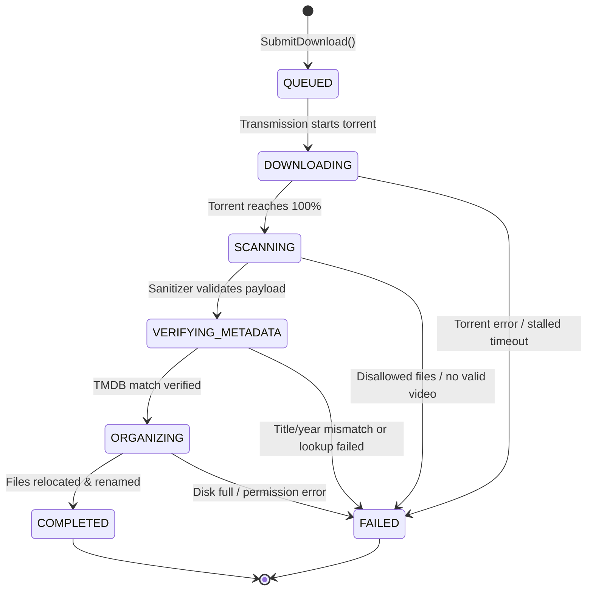

# 🏛️ MagNetFlix — Architecture & System Design

MagNetFlix uses a **Backend-For-Frontend (BFF)** pattern paired with an internal **gRPC Worker** pipeline service to decouple public web endpoints from disk I/O and media processing.

---

## 📐 High-Level Architecture



---

## 🔄 Job State Machine & Lifecycle Rules

The pipeline worker operates strictly as a finite state machine with terminal failure handling.



### Transition & Failure Invariants
1. **Linear Progression**: `QUEUED` ➔ `DOWNLOADING` ➔ `SCANNING` ➔ `VERIFYING_METADATA` ➔ `ORGANIZING` ➔ `COMPLETED`.
2. **Terminal Failure**: Any failure at any phase transitions the job directly to `FAILED` with a populated `error_message`.
3. **Crash & Restart Recovery**: Upon worker startup, any orphaned non-terminal jobs (`QUEUED`, `DOWNLOADING`, `SCANNING`, `VERIFYING_METADATA`, `ORGANIZING`) in the SQLite database are automatically transitioned to `FAILED` with reason `"Worker restarted during execution"`. Retrying requires a new submission.
4. **Duplicate Rejection (Idempotency)**:
   - A submission is rejected if a non-terminal job for the same `imdb_id` is currently active in the database.
   - A submission is rejected if `/media/movies/*[imdbid-{imdb_id}]` already exists in the destination library.

---

## 🛡️ Security & Media Sanitizer Specification

The sanitizer enforces a strict file-system boundary before files are touched or moved:

1. **Path Traversal & Symlink Check**: Rejects any archive or torrent payload containing symbolic links, hard links, or paths escaping the staging root (`..`).
2. **File Allowlist**:
   - **Allowed Video**: `.mkv`, `.mp4`, `.avi`, `.webm`
   - **Allowed Subtitles**: `.srt`, `.vtt`, `.sub`, `.ass`
   - **Forbidden / Quarantine**: `.exe`, `.bat`, `.cmd`, `.sh`, `.scr`, `.vbs`, `.lnk`, `.iso`, `.zip`, `.rar`, etc.
3. **Multiple Video Selection (Largest File Rule)**:
   - Files containing `sample` in the filename or with size `< 100MB` are discarded.
   - If multiple video files remain, the **single largest video file** is selected as the primary feature film. A warning is logged listing ignored video files.
   - If 0 eligible video files remain, the job transitions to `FAILED`.

---

## 🎬 Metadata Authority & Verification Criteria

- **Authority**: **The Movie Database (TMDB) API** using the `/find/{imdb_id}?external_source=imdb_id` endpoint.
- **Verification Criteria**:
  - The canonical title and release year are fetched from TMDB.
  - A normalized token comparison is performed between the TMDB movie title/year and the torrent folder name / primary video filename.
  - If there is zero token overlap between the metadata title/year and the torrent name, the job transitions to `FAILED` (`"Torrent payload does not appear to match TMDB metadata"`).

---

## 📂 Storage Paths & Naming Convention

- **Canonical Staging Path**: `/data/staging/<job_id>/`
- **Canonical Library Destination**:
  ```text
  /media/movies/<Title> (<Year>) [imdbid-<IMDbID>]/<Title> (<Year>).<ext>
  /media/movies/<Title> (<Year>) [imdbid-<IMDbID>]/<Title> (<Year>).en.srt
  ```
- **Cleanup**: The `/data/staging/<job_id>/` folder is purged immediately upon successful completion or terminal failure.

---

## 🔐 Security Boundaries & Health Endpoints

### Authentication Trust Boundary
- The FastAPI BFF trusts `Remote-User` and `Remote-Email` headers **strictly because it is reachable exclusively through the authenticated Traefik reverse proxy**. Direct ingress from outside the Docker network is prohibited.

### Health & Readiness Probes
- **BFF**: `GET /healthz` (Verifies FastAPI liveness + gRPC worker channel connectivity).
- **Worker**: gRPC standard health checking protocol (`grpc.health.v1.Health`) + Transmission RPC ping.
