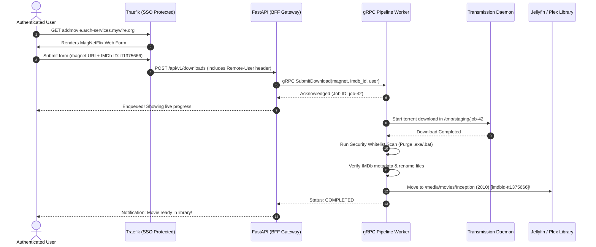

# 🌟 MagNetFlix — Overview

**MagNetFlix** is a self-hosted, automated media acquisition pipeline. It bridges the gap between web-based movie requests and structured, verified media storage in a secure, audited environment.

---

## 🎯 The Problem & Mission

When self-hosting a media server (Jellyfin/Plex):
1. Adding movies manually requires downloading torrents, monitoring client progress, manually checking for malicious/garbage files, and renaming folders to match IMDb/TMDB conventions.
2. In multi-user setups, tracking who requested what and keeping track of download failures is difficult without a dedicated audit log.

**MagNetFlix** solves this with an end-to-end automated workflow:
- **Input**: A simple web form protected by **Authelia SSO** accepting an **IMDb ID** and a **Magnet URI**.
- **Processing**: A background **gRPC worker** handles downloading via Transmission into a sandboxed staging directory.
- **Safety**: Recursively scans and purges all non-media/dangerous executable files.
- **Organization**: Fetches official metadata for the IMDb ID, verifies movie details, and places renamed media files into your library structure.
- **Observability**: Live status tracking and persistent audit logs.

---

## 🎬 User Workflow

