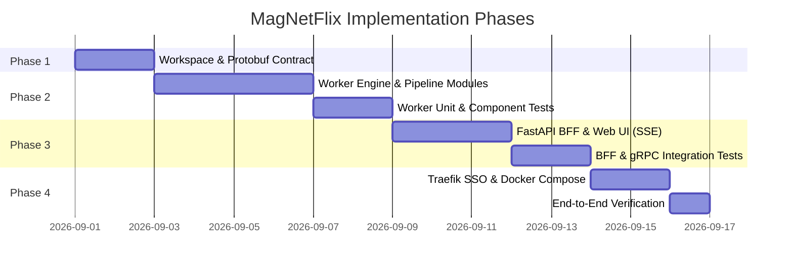

# 🗺️ MagNetFlix — Development Roadmap

This roadmap breaks down the construction of **MagNetFlix** into clear, incremental milestones with testing embedded in each stage.

---

## 🎯 Milestones Overview

---

## 📌 Phase 1: Repository Foundation & Protobuf Contracts
- [x] Initialize `uv` workspace with `services/bff` and `services/worker`.
- [x] Configure `buf.yaml` and `buf.gen.yaml` with Python & gRPC stubs generation.
- [x] Define `proto/magnetflix/v1/pipeline.proto` with pagination, `updated_at`, and streaming snapshot semantics.
- [x] Create developer guidelines (`AGENTS.md` and `CLAUDE.md`).

---

## 📌 Phase 2: Pipeline Worker & Security Engine
- [ ] Set up SQLite with WAL mode via SQLAlchemy 2.0 and Alembic migrations.
- [ ] Implement Transmission daemon RPC client wrapper.
- [ ] Implement isolated scratch staging (`/data/staging/<job_id>`).
- [ ] Build **Media Sanitizer & Allowlist**:
  - Symlink & path traversal blocker.
  - Video & subtitle extension whitelist.
  - Sample file discard (<100MB / "sample") & largest video file selector.
- [ ] Build **TMDB Metadata Verifier**: Fetch title/year from TMDB via IMDb ID and perform token overlap verification.
- [ ] Build **Library Relocator**: Move verified video and `.srt` files into final Jellyfin/Plex structure.
- [ ] **Phase 2 Tests**:
  - `tests/test_sanitizer.py`: Unit tests for allowlist, traversal, and largest video file selection.
  - `tests/test_metadata.py`: Unit tests for TMDB client and token matching logic.
  - `tests/test_state_machine.py`: Unit tests for linear transitions, failure transitions, and restart recovery.
  - `tests/test_transmission.py`: Mocked Transmission RPC client tests.

---

## 📌 Phase 3: BFF Gateway & Live Dashboard
- [ ] Build FastAPI application with Pydantic v2 schemas.
- [ ] Add Authelia SSO header middleware (`Remote-User`, `Remote-Email`).
- [ ] Implement gRPC client wrapper in BFF.
- [ ] Build clean HTML form (PicoCSS / Tailwind) for adding movies.
- [ ] Implement Server-Sent Events (SSE) route `/api/v1/movies/events` connected to gRPC streaming updates.
- [ ] Build live progress dashboard showing active and completed downloads.
- [ ] **Phase 3 Tests**:
  - `tests/test_bff_routes.py`: FastAPI route and header extraction tests.
  - `tests/test_grpc_integration.py`: End-to-end gRPC communication between BFF and Worker.
  - `tests/test_sse_stream.py`: SSE stream snapshot and event emission tests.

---

## 📌 Phase 4: Containerization & Traefik Integration
- [ ] Create multi-stage `Dockerfile` for `bff` and `worker`.
- [ ] Create production-ready `docker-compose.yml` including Transmission daemon and shared volumes.
- [ ] Configure Traefik labels for `addmovie.arch-services.mywire.org` with Authelia middleware.
- [ ] Configure health and readiness probes (`/healthz`, gRPC health service).
- [ ] **Phase 4 Tests**: Full end-to-end dry-run with a public domain torrent.
